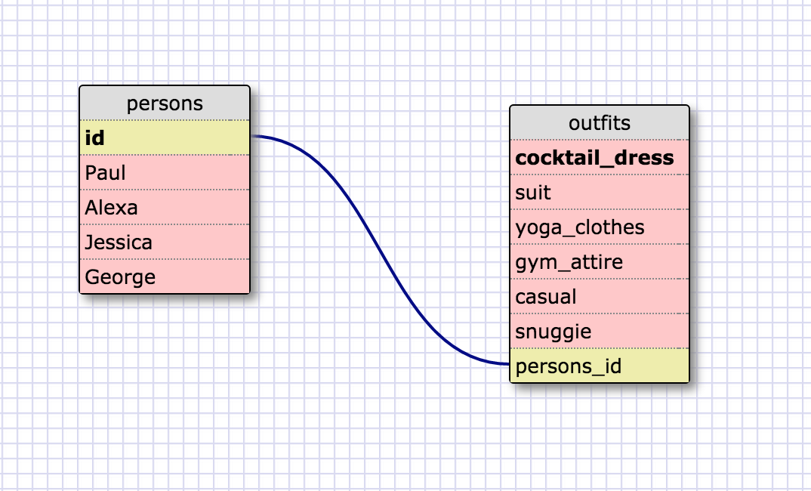

1. Select all data for all states.

	SELECT * FROM states;

2. Select all data for all regions.

	SELECT * FROM regions;

3. Select the state_name and population for all states.

	SELECT state_name, population FROM states;

4. Select the state_name and population for all states ordered by population. The state with the highest population should be at the top.

	SELECT state_name, population FROM states ORDER BY population DESC;

5. Select the state_name for the states in region 7.

	SELECT * FROM states WHERE region_id = 7;

6. Select the state_name and population_density for states with a population density over 50 ordered from least to most dense.

	SELECT state_name, population_density FROM states 
	WHERE population_density > 50 
	ORDER BY population_density DESC;

7. Select the state_name for states with a population between 1 million and 1.5 million people.
	
	SELECT state_name FROM states 
	WHERE population > 1000000 AND population < 1500000;

8. Select the state_name and region_id for states ordered by region in ascending order.

	SELECT state_name, region_id FROM states ORDER BY region_id ASC;

9. Select the region_name for the regions with "Central" in the name.

	SELECT * FROM regions WHERE region_name LIKE '%Central%';

10. Select the region_name and the state_name for all states and regions in ascending order by region_id. Refer to the region by name. (This will involve joining the tables).

	SELECT * FROM regions JOIN states ON regions.id = states.region_id;

-- REFLECTION -- 

-What are databases for?

Databases are for efficiently storing, accessing and manipulating data. Usuing 
languages like SQL makes this easier.

-What is a one-to-many relationship?

For example one country can have an unlimited amount of citizens, but each 
citizen can only be a citizen of one country(I know this isn't completely true).
These relationships are important to consider when building related tables.

-What is a primary key? What is a foreign key? How can you determine which is which?

A primary key is a key that uniquely identifies a data piece in a table, a 
foriegn key is a field in another table that references the primary key. You 
could probably tell which is which by the name, or which table points to which.

-How can you select information out of a SQL database? What are some general guidelines for that?

You can use SELECT to select specific columns, portions of specific columns, or
even specific data derived from those columns. You can also use different 
commands to sort the data.

