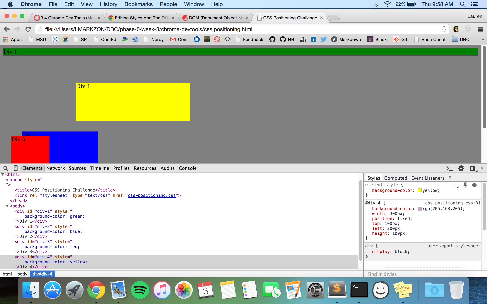
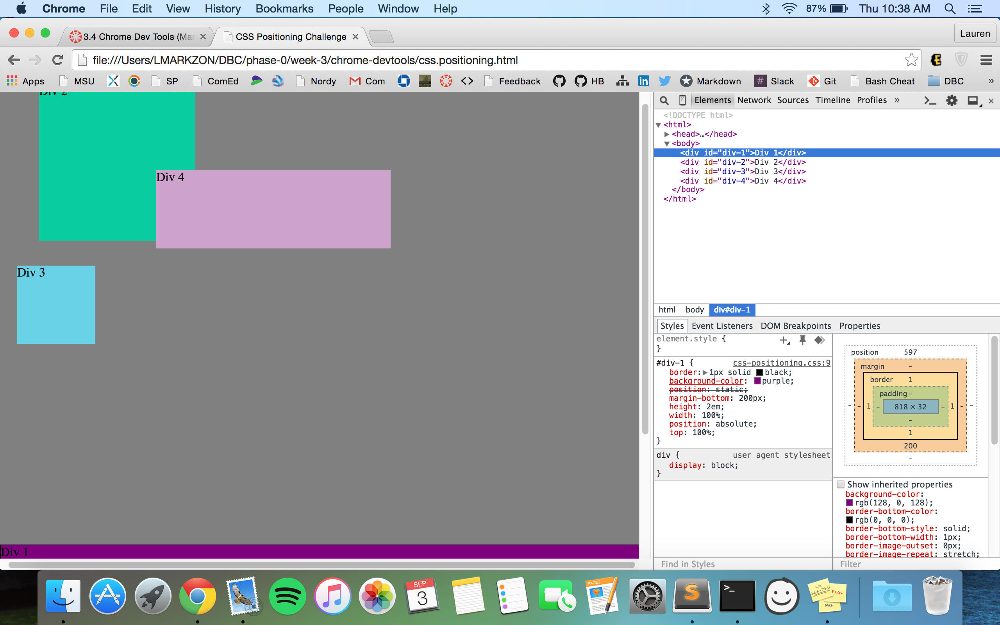

1. Change Color

2. Columns

3. Rows

4. Make Equidistant

5. Squares

6. Footer

7. Header

8. Sidebar

9. Creativity (yay!)

###3.4 Reflection
-How can you use Chrome's DevTools inspector to help you format or position elements?

Chrome's DevTools makes it easy to format and position elements in a few ways. First it highlights what elements on the page are being referenced when you mouse-over segments of code. Second, it gives you a visual representation of the margins, padding and other spacing elements making borders less abstract. Third, it allows you to experiment in the code and instantly see the results. 

-How can you resize elements on the DOM using CSS?

You can resize elements using CSS by changing settings like height and width. 

-What are the differences between Absolute, Fixed, Static, and Relative positioning? Which did you find easiest to use? Which was most difficult?

Absolute positioning lets you manipulate the position of an element based on the element that's directly above it in the DOM tree. 

Fixed positioning lets you manipulate the position of an element based on the frame of the page. 

Static positioning can't be moved around, elements just fall into their natural positioning according to the flow of the page.

Relative positioning can be moved around relative to where it would have naturally be positioned.

I don't find one way of positioning harder than any other, it was just a lot to take in at first. After reading it over a second time I feel much more confident. 

-What are the differences between Margin, Border, and Padding?

Padding is the transparent space around the element(be that text, image, link ect.). Border is a border that goes around the element and the padding-- We can edit the color, size and style of the border. Marget is like a padding for the border-- It's transparent and clears space around the border. 

-What was your impression of this challenge overall? (love, hate, and why?)

I thought it was fine- It was a pain to format the boxes back to their original color/position after each release. Other than that it was pretty self explainitory and we didn't have too much trouble getting through it. 

